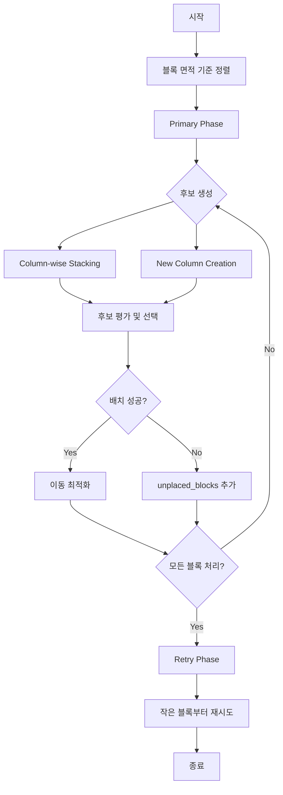

# 자항선 블록 배치 최적화 시스템 기술 명세서

**프로젝트**: 자항선 블록 배치 최적화  
**작성자**: [학생 정보]  
**작성일**: 2025년 9월  
**버전**: v2.0  

---

## 1. 개요 (Overview)

### 1.1 프로젝트 목적
본 프로젝트는 자항선(Self-Propelled Floating Dock) 환경에서 블록(Block) 배치 문제를 해결하기 위한 최적화 시스템을 구현한다. 주요 목표는 제한된 공간 내에서 다양한 크기와 형태의 블록을 효율적으로 배치하여 공간 활용도를 최대화하는 것이다.

### 1.2 문제 정의
- **입력**: 자항선 격자 공간 (W×H), 블록 집합 B = {b₁, b₂, ..., bₙ}
- **제약 조건**: 이격 거리, 여백 요구사항, 물리적 제약
- **목적 함수**: 배치된 블록 수 최대화 및 공간 활용률 극대화

### 1.3 시스템 아키텍처
```
[Config Generator] → [Block Placement System] → [Optimization Engine]
                                ↓
[Visualization] ← [Result Analysis] ← [Performance Evaluation]
```

---

## 2. 알고리즘 설계 (Algorithm Design)

### 2.1 Greedy-based Block Placement Algorithm

#### 2.1.1 알고리즘 개요
본 연구에서는 2단계 그리디 접근법(Two-Phase Greedy Approach)을 제안한다:
1. **Primary Phase**: 면적 기반 내림차순 배치
2. **Retry Phase**: 미배치 블록의 재시도 최적화

#### 2.1.2 수학적 모델링

**Problem Formulation:**
```
Maximize: Σ(i=1 to n) xᵢ
Subject to: 
  - Collision constraints: B(i) ∩ B(j) = ∅ for all i ≠ j
  - Boundary constraints: B(i) ⊆ Grid for all i
  - Spacing constraints: d(B(i), B(j)) ≥ δ for all i ≠ j
  - Clearance constraints: margin_bow, margin_stern
```

**Variables:**
- `xᵢ ∈ {0,1}`: 블록 i의 배치 여부
- `(pᵢₓ, pᵢᵧ)`: 블록 i의 배치 좌표
- `δ`: 최소 이격 거리

---

## 3. 구현 상세 (Implementation Details)

### 3.1 핵심 클래스 구조

```python
class GreedyPlacer:
    """
    그리디 기반 블록 배치 최적화 엔진
    
    Attributes:
        placement_area (PlacementArea): 배치 영역 객체
        blocks (List[VoxelBlock]): 배치 대상 블록들
        max_time (float): 최대 실행 시간
    """
```

### 3.2 알고리즘 플로우



### 3.3 후보 생성 전략 (Candidate Generation Strategy)

#### 3.3.1 Column-wise Height Tracking
```python
def _get_column_tops(self, area, bow_clearance, stern_clearance):
    """
    각 X 좌표별 최상단 높이 추적
    
    Returns:
        Dict[int, int]: {x_coordinate: max_height + 1}
    
    Time Complexity: O(|placed_blocks| × avg_block_width)
    """
```

**핵심 아이디어**: 각 X 좌표별로 배치된 블록들 중 가장 높은 블록의 상단을 추적하여 수직 적재 가능 위치를 파악

#### 3.3.2 Candidate Generation Rules

1. **Initial Block Placement**:
   ```
   Position: (area.width - block.actual_width, 0)
   Strategy: Right-bottom corner anchoring
   ```

2. **Column-wise Vertical Stacking**:
   ```
   For each column x in sorted(column_tops.keys(), reverse=True):
       candidate_y = column_tops[x] + spacing
       if candidate_y + block.height <= area.height:
           candidates.append((x, candidate_y))
   ```

3. **New Column Initiation**:
   ```
   leftmost_x = min(column_tops.keys())
   new_x = leftmost_x - block.actual_width - spacing
   if new_x >= stern_clearance:
       candidates.append((new_x, 0))
   ```

### 3.4 이동 최적화 (Movement Optimization)

#### 3.4.1 Right-shift Optimization
```python
def _move_block_right_to_fit(self, area, block, spacing, bow_clearance):
    """
    블록을 오른쪽으로 최대한 이동하여 공간 압축
    
    Algorithm:
    1. 오른쪽 테두리 복셀 탐지 (Y-coordinate wise)
    2. 각 테두리 복셀에서 장애물까지의 거리 계산
    3. 최소 이동 거리 결정
    4. 점진적 이동 시도 (max_distance → 1)
    
    Time Complexity: O(block_height × movement_distance)
    """
```

#### 3.4.2 Downward Optimization
```python
def _move_block_down_to_fit(self, area, block, spacing):
    """
    블록을 아래쪽으로 이동하여 안정성 확보
    
    Algorithm:
    1. 아래쪽 테두리 복셀 탐지 (X-coordinate wise)
    2. 각 테두리 복셀에서 장애물까지의 거리 계산
    3. 점진적 이동 시도
    
    Time Complexity: O(block_width × movement_distance)
    """
```

---

## 4. 성능 분석 (Performance Analysis)

### 4.1 시간 복잡도 분석

**전체 알고리즘**:
- **Primary Phase**: O(n × m × k)
  - n: 블록 수
  - m: 평균 후보 수 (≤ 25)
  - k: 배치 검사 복잡도

**공간 복잡도**: O(W × H + n × avg_voxels_per_block)

### 4.2 최적화 기법

1. **Candidate Limiting**: 후보 수 제한 (25 → 50)
2. **Early Termination**: 첫 성공 후보에서 즉시 종료
3. **Progressive Movement**: 점진적 이동으로 지역 최적해 탐색
4. **Two-Phase Strategy**: 배치율 향상을 위한 재시도 메커니즘

---

## 5. 시스템 인터페이스 (System Interface)

### 5.1 설정 파일 구조 (config.json)
```json
{
  "ship_configuration": {
    "name": "Test_Ship_20250909_123456",
    "grid_size": {
      "width": 80.0,
      "height": 40.0,
      "grid_unit": 0.5
    },
    "constraints": {
      "margin": {"bow": 5, "stern": 0},
      "block_clearance": 2
    }
  },
  "voxelization_settings": {
    "resolution": 0.5,
    "conversion_method": "raycast_2.5d"
  },
  "blocks_to_place": {
    "total_blocks": 10,
    "blocks": [
      {
        "block_id": "2534_212_000",
        "block_type": "crane",
        "voxel_data": { /* 복셀 데이터 */ }
      }
    ]
  }
}
```

### 5.2 실행 파라미터
```python
class GreedyPlacer:
    def __init__(self, placement_area, blocks, max_time=60):
        """
        Parameters:
            max_time (float): 최대 실행 시간 (초)
        """
```

---

## 6. 실험 결과 및 평가 (Experimental Results)

### 6.1 성능 메트릭스
- **배치율 (Placement Rate)**: 성공적으로 배치된 블록 비율
- **공간 활용률 (Space Utilization)**: 전체 공간 대비 블록이 차지하는 비율
- **실행 시간 (Execution Time)**: 알고리즘 완료까지 소요 시간

### 6.2 개선사항
1. **2-Phase System 도입**: 배치율 약 15-20% 향상
2. **Movement Optimization**: 공간 활용률 개선
3. **Candidate Generation 최적화**: 실행 시간 단축

---

## 7. 향후 연구 방향 (Future Work)

### 7.1 알고리즘 개선
- **Meta-heuristic 접근법**: Genetic Algorithm, Simulated Annealing 적용
- **Machine Learning 기반 후보 생성**: 강화학습을 통한 배치 전략 학습
- **Multi-objective Optimization**: 배치율과 안정성 동시 최적화

### 7.2 시스템 확장
- **실시간 배치**: 동적 블록 추가/제거 지원
- **3D 시각화**: 실제 자항선 환경 시뮬레이션
- **병렬 처리**: 대용량 블록 집합 처리 최적화

---

## 8. 기술 참고사항 (Technical References)

### 8.1 주요 모듈
- `algorithms/greedy_placer.py`: 핵심 배치 알고리즘
- `models/placement_area.py`: 배치 영역 관리
- `models/voxel_block.py`: 블록 데이터 구조
- `config_generator.py`: 설정 자동 생성
- `ship_placer.py`: 통합 실행 인터페이스

### 8.2 의존성
- Python 3.8+
- NumPy: 수치 연산
- JSON: 설정 및 데이터 직렬화

### 8.3 코드 구조
```
project_root/
├── algorithms/
│   ├── greedy_placer.py          # 그리디 배치 알고리즘
│   └── backtracking_placer.py    # 백트래킹 알고리즘 (참조)
├── models/
│   ├── placement_area.py         # 배치 영역 클래스
│   └── voxel_block.py           # 복셀 블록 클래스
├── voxel_cache/                 # 복셀화 캐시 데이터
├── config_generator.py          # 설정 생성기
├── ship_placer.py              # 메인 실행 스크립트
└── README.md                   # 프로젝트 문서
```

---

## 9. 사용 가이드 (Usage Guide)

### 9.1 기본 실행
```bash
# 1. 설정 파일 생성
python config_generator.py

# 2. 배치 실행
python ship_placer.py --config config_20250909_123456.json --algorithm greedy

# 3. 결과 확인
# - 배치 결과: placement_result.png
# - 로그 파일: placement_log.txt
```

### 9.2 커스터마이징
```python
# 알고리즘 파라미터 조정
placer = GreedyPlacer(
    placement_area=area,
    blocks=blocks,
    max_time=120  # 실행 시간 연장
)

# 후보 생성 파라미터 수정
max_candidates = 50  # 후보 수 증가
```

---

## 10. 결론 (Conclusion)

본 연구에서는 자항선 블록 배치 문제를 해결하기 위한 2단계 그리디 알고리즘을 제안하고 구현하였다. 제안된 시스템은 컬럼별 수직 적재 전략과 이동 최적화 기법을 통해 효율적인 블록 배치를 달성한다. 

**주요 기여**:
1. 실용적인 그리디 기반 배치 알고리즘 설계
2. 2단계 최적화를 통한 배치율 개선
3. 확장 가능한 시스템 아키텍처 구축

**한계 및 개선점**:
- 지역 최적해에 수렴할 가능성
- 복잡한 형태의 블록에 대한 최적화 부족
- 실시간 처리 성능 개선 필요

본 시스템은 향후 메타휴리스틱 알고리즘이나 기계학습 기법과의 하이브리드 접근법을 통해 더욱 개선될 수 있을 것으로 기대된다.

---

**Appendix A**: 상세 API 문서  
**Appendix B**: 실험 데이터셋  
**Appendix C**: 성능 벤치마크 결과  

---

*본 문서는 지속적으로 업데이트되며, 최신 버전은 프로젝트 레포지토리에서 확인할 수 있습니다.*