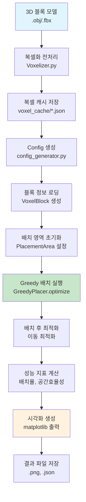
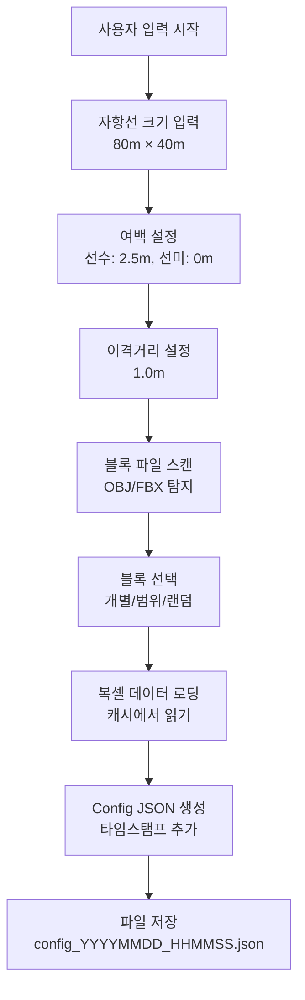

# 자항선 블록 배치 시스템 전체 개요서
---

## 📋 목차

1. [시스템 개요](#1-시스템-개요)
2. [전체 워크플로우](#2-전체-워크플로우)
3. [복셀화 전처리](#3-복셀화-전처리)
4. [Config 생성 시스템](#4-config-생성-시스템)
5. [Greedy 배치 알고리즘](#5-greedy-배치-알고리즘)
6. [성능 평가 및 시각화](#6-성능-평가-및-시각화)
7. [사용 가이드](#7-사용-가이드)

---

## 1. 시스템 개요

### 1.1 프로젝트 목적
본 시스템은 **자항선(Self-Propelled Floating Dock) 환경**에서 다양한 형태의 블록을 효율적으로 배치하는 문제를 해결합니다. 복잡한 3D 블록 모델을 2.5D 복셀로 변환하고, 최적화된 배치 알고리즘을 통해 공간 활용도를 극대화합니다.

### 1.2 핵심 특징
- **복셀 기반 배치**: 3D 블록을 2.5D 복셀로 변환하여 정확한 배치
- **문제 특화 알고리즘**: 선박 환경에 최적화된 Greedy 배치 전략
- **자동화된 워크플로우**: 전처리부터 시각화까지 완전 자동화
- **실시간 성능 분석**: 다양한 지표를 통한 배치 품질 평가

### 1.3 전체 시스템 아키텍처
```
┌─────────────────┐   ┌─────────────────┐   ┌─────────────────┐
│   3D 블록 모델    │──▶│   복셀화 전처리   │──▶│  복셀 캐시 저장   │
│  (.obj/.fbx)    │   │  (Voxelizer)    │   │   (.json)      │
└─────────────────┘   └─────────────────┘   └─────────────────┘
                                                     │
┌─────────────────┐   ┌─────────────────┐            │
│  시각화 및 분석   │◀──│   배치 실행       │◀───────────┘
│ (Visualization) │   │ (Ship Placer)   │
└─────────────────┘   └─────────────────┘
                             ▲
                      ┌─────────────────┐
                      │   Config 생성    │
                      │ (Config Gen.)   │
                      └─────────────────┘
```

---

## 2. 전체 워크플로우

### 2.1 End-to-End 프로세스



### 2.2 핵심 단계별 설명

#### **Phase 1: 전처리 (Preprocessing)**
1. **3D 모델 입력**: OBJ/FBX 형태의 블록 모델
2. **복셀화**: 2.5D 복셀 그리드로 변환 (0.5m 해상도)
3. **캐시 저장**: JSON 형태로 복셀 데이터 저장

#### **Phase 2: 설정 (Configuration)**
1. **사용자 입력**: 자항선 크기, 여백, 제약 조건
2. **블록 선택**: 배치할 블록 리스트 선정
3. **Config 생성**: JSON 설정 파일 자동 생성

#### **Phase 3: 배치 (Placement)**
1. **환경 초기화**: 배치 영역 및 제약 조건 설정
2. **Greedy 알고리즘**: 2단계 그리디 배치 실행
3. **후처리 최적화**: 배치 후 이동 최적화

#### **Phase 4: 평가 (Evaluation)**
1. **성능 지표**: 배치율, 공간 효율성, Dead Space 등
2. **시각화**: 배치 결과 그래픽 출력
3. **결과 저장**: PNG, JSON 형태 저장

---

## 3. 복셀화 전처리

### 3.1 복셀화 시스템 개요

복셀화는 **3D 블록 모델을 2.5D 격자 기반 표현으로 변환**하는 핵심 전처리 과정입니다.

```python
# 복셀화 실행 예시
python Voxelizer.py --input fbx_blocks/converted_obj/ --resolution 0.5
```

### 3.2 복셀화 프로세스

#### **3.2.1 입력 데이터**
- **3D 모델 파일**: `.obj` 또는 `.fbx` 형식
- **해상도 설정**: 0.5m per voxel (선박 스케일 최적화)
- **변환 방법**: Trimesh 내장 복셀화 + 방향 최적화

#### **3.2.2 변환 알고리즘**
```python
def voxelize_block(obj_file, resolution=0.5):
    """
    3D 모델을 2.5D 복셀로 변환
    
    Process:
    1. 3D 메시 로딩 및 정규화
    2. Trimesh 내장 복셀화 함수 사용 (mesh.voxelized())
    3. 자동 방향 최적화 (바닥 접촉면 최대화)
    4. 2.5D 복셀 위치 및 높이 정보 생성
    
    Returns:
        voxel_data: {
            'method': 'footprint_trimesh',
            'resolution': 0.5,
            'orientation_optimized': True,
            'selected_orientation': 'original',
            'optimization_method': 'area_maximization_with_flatness',
            'total_volume': int,
            'footprint_area': int,
            'voxel_positions': [(x, y, [height, count])]
        }
    """
```

#### **3.2.3 출력 데이터 구조**
```json
{
  "block_id": "2534_212_000",
  "block_type": "trestle",
  "source_file": "fbx_blocks\\converted_obj\\2534_212_000.obj",
  "voxel_data": {
    "method": "footprint_trimesh",
    "resolution": 0.5,
    "orientation_optimized": true,
    "selected_orientation": "original",
    "optimization_method": "area_maximization_with_flatness",
    "total_volume": 10070,
    "footprint_area": 1007,
    "voxel_positions": [
      [0, 0, [6, 1]],
      [0, 1, [6, 1]],
      [0, 2, [5, 2]]
    ]
  }
}
```

### 3.3 복셀 캐시 시스템

#### **3.3.1 캐시 관리**
- **저장 위치**: `voxel_cache/{block_id}.json`
- **자동 갱신**: 원본 모델 변경 시 재생성
- **타입 분류**: 크레인(`crane`) vs 트레슬(`trestle`) 자동 감지

#### **3.3.2 성능 최적화**
- **원본 독립성**: 복셀 데이터만으로 배치 가능
- **빠른 로딩**: JSON 직접 로딩으로 전처리 시간 단축
- **메모리 효율**: 압축된 복셀 표현

---

## 4. Config 생성 시스템

### 4.1 Config Generator 개요

**자동화된 설정 생성기**로, 사용자 입력을 받아 배치 시스템에 필요한 모든 설정을 JSON 형태로 생성합니다.

```python
python config_generator.py
```

### 4.2 설정 구성 요소

#### **4.2.1 자항선 기본 설정**
```python
ship_configuration = {
    "name": "Test_Ship_20250911_143022",
    "grid_size": {
        "width": 80.0,      # 자항선 너비 (미터)
        "height": 40.0,     # 자항선 높이 (미터)  
        "grid_unit": 0.5    # 격자 단위 (미터/격자)
    }
}
```

#### **4.2.2 제약 조건 설정**
```python
constraints = {
    "margin": {
        "bow": 5,           # 선수 여백 (격자 수)
        "stern": 0          # 선미 여백 (격자 수)
    },
    "block_clearance": 2,   # 블록 간 최소 이격거리
    "ring_bow_clearance": 20 # 크레인 전용 선수 여백
}
```

#### **4.2.3 블록 선택 시스템**
- **자동 탐지**: `fbx_blocks/converted_obj/` 폴더 스캔
- **다양한 선택**: 개별 선택, 범위 선택, 랜덤 선택
- **타입 자동 분류**: 크레인/트레슬 블록 자동 인식

### 4.3 Config 생성 워크플로우



---

## 5. Greedy 배치 알고리즘

### 5.1 알고리즘 개요

**2단계 그리디 접근법(Two-Phase Greedy Approach)**을 사용하여 효율적인 블록 배치를 달성합니다.

#### **5.1.1 핵심 전략**
1. **컬럼별 수직 적재**: 기존 블록 위에 새 블록 쌓기
2. **오른쪽 우선**: 선수(bow) 방향 우선 배치
3. **이동 최적화**: 배치 후 공간 압축 최적화

#### **5.1.2 수학적 모델**
```
목적 함수: Maximize Σ(i=1 to n) x_i
제약 조건:
  - 충돌 방지: B(i) ∩ B(j) = ∅ for all i ≠ j
  - 영역 경계: B(i) ⊆ Grid for all i
  - 이격 거리: d(B(i), B(j)) ≥ δ for all i ≠ j
  - 여백 제약: margin_bow, margin_stern
  - 접근성: 트레슬 블록의 수평 접근로 확보
```

### 5.2 단계별 알고리즘

#### **5.2.1 Primary Phase (1차 배치)**

```python
def optimize_primary_phase(self):
    """
    1차 배치: 면적 순으로 큰 블록부터 배치
    """
    # 1. 블록 정렬 (면적 기준 내림차순)
    sorted_blocks = sorted(self.blocks, key=lambda b: -b.get_area())
    
    for block in sorted_blocks:
        # 2. 후보 위치 생성
        candidates = self._get_tight_candidates(area, block)
        
        # 3. 첫 번째 가능한 위치에 배치
        for pos_x, pos_y in candidates:
            if area.can_place_block(block, pos_x, pos_y):
                area.place_block(block, pos_x, pos_y)
                # 4. 배치 후 이동 최적화
                self._optimize_placement(area, block)
                break
        else:
            # 배치 실패시 재시도 목록에 추가
            unplaced_blocks.append(block)
```

#### **5.2.2 후보 생성 전략**

**a) 첫 번째 블록**:
```python
# 오른쪽 아래 모서리 배치
position = (area.width - block.actual_width, 0)
```

**b) 컬럼별 수직 적재**:
```python
def _get_column_tops(self, area):
    """각 X 좌표별 최고 높이 추적"""
    column_tops = {}
    for placed_block in area.placed_blocks.values():
        # 블록이 차지하는 X 범위의 최고점 업데이트
        for x in range(block_start_x, block_end_x):
            column_tops[x] = max(column_tops.get(x, 0), block_top_y + 1)
    return column_tops

# 수직 적재 후보 생성
for x in sorted(column_tops.keys(), reverse=True):  # 오른쪽부터
    candidate_y = column_tops[x] + spacing
    if candidate_y + block.height <= area.height:
        candidates.append((x, candidate_y))
```

**c) 새 컬럼 시작**:
```python
# 기존 컬럼들의 왼쪽에 새 컬럼 생성
leftmost_x = min(column_tops.keys())
new_x = leftmost_x - block.actual_width - spacing
if new_x >= stern_clearance:
    candidates.append((new_x, 0))
```

#### **5.2.3 이동 최적화**

**a) 오른쪽 이동 (Right-shift)**:
```python
def _compact_block_right(self, area, block, spacing, bow_clearance):
    """
    블록을 오른쪽으로 최대한 이동하여 공간 압축
    
    Algorithm:
    1. 오른쪽 테두리 복셀들 탐지 (Y별 최우측)
    2. 각 테두리에서 장애물까지 거리 계산
    3. 최소 이동 가능 거리 결정
    4. 점진적 이동 시도 (최대 거리부터 1칸씩 감소)
    """
    # 오른쪽 테두리 복셀 찾기
    right_edge_voxels = self._get_right_boundary_voxels(block)
    
    min_move_distance = float('inf')
    for edge_x, edge_y in right_edge_voxels:
        # 장애물까지의 거리 계산
        for test_x in range(edge_x + 1, area.width):
            if area.grid[edge_y, test_x] is not None:
                obstacle_distance = test_x - edge_x - spacing
                min_move_distance = min(min_move_distance, obstacle_distance)
                break
    
    # 점진적 이동 시도
    for distance in range(min_move_distance, 0, -1):
        target_x = current_x + distance
        if self._try_move_block(block, target_x, current_y):
            return True
    return False
```

**b) 아래쪽 이동 (Downward)**:
```python
def _compact_block_down(self, area, block, spacing):
    """
    블록을 아래쪽으로 이동하여 안정성 확보
    
    Similar to right-shift but for vertical movement
    """
    bottom_edge_voxels = self._get_bottom_boundary_voxels(block)
    # 아래쪽 장애물까지의 거리 계산 및 점진적 이동
```

#### **5.2.4 Retry Phase (2차 재시도)**

```python
def optimize_retry_phase(self, unplaced_blocks):
    """
    2차 재시도: 작은 블록부터 틈새 활용
    """
    # 작은 블록부터 재시도 (면적 순 오름차순)
    unplaced_blocks.sort(key=lambda b: b.get_area())
    
    for block in unplaced_blocks:
        # 더 많은 후보 생성 (25 → 50개)
        max_candidates = min(50, len(area.placed_blocks) * 10 + 30)
        candidates = self._get_tight_candidates(area, block, max_candidates)
        
        # 틈새 배치 시도
        for pos_x, pos_y in candidates:
            if area.can_place_block(block, pos_x, pos_y):
                area.place_block(block, pos_x, pos_y)
                self._optimize_placement(area, block)
                break
```

크레인 블록의 경우 배치 시 90도 회전을 고려 (메가팩션 외 자항선의 크레인 블록 배치 고려)

### 5.3 제약 조건 검사

#### **5.3.1 블록 타입별 제약**

**크레인 블록**:
```python
def _check_crane_constraints(self, block, pos_x, pos_y):
    """
    크레인 블록 전용 제약 검사
    """
    # Ring bow clearance 확인
    if hasattr(area, 'ring_bow_clearance'):
        total_available_width = area.width + area.bow_clearance
        distance_from_bow = total_available_width - grid_x - 1
        if distance_from_bow < area.ring_bow_clearance:
            return False
    
    # 수직 접근 가능 (별도 접근로 불필요)
    return True
```

**트레슬 블록**:
```python
def _check_trestle_constraints(self, block, pos_x, pos_y):
    """
    트레슬 블록 수평 접근로 확인
    """
    block_y_start = pos_y
    block_y_end = pos_y + block.height
    block_left_edge = pos_x
    
    # 왼쪽 끝에서 블록까지 수평 접근로 확보
    for x in range(0, block_left_edge):
        for y in range(block_y_start, block_y_end):
            if area.grid[y, x] is not None:
                return False  # 접근로 차단
    return True
```

#### **5.3.2 이격거리 검사**

```python
def _check_spacing_constraints(self, block, pos_x, pos_y):
    """
    복셀 단위 이격거리 검사 (테두리 기반)
    """
    # 새 블록의 테두리 복셀 추출
    new_boundary = self._get_boundary_voxels(block, pos_x, pos_y)
    
    for placed_block in area.placed_blocks.values():
        placed_boundary = self._get_boundary_voxels(placed_block)
        
        # 테두리 복셀 간 최소 거리 계산
        for new_x, new_y in new_boundary:
            for placed_x, placed_y in placed_boundary:
                distance = self._calculate_voxel_distance(
                    (new_x, new_y), (placed_x, placed_y)
                )
                if distance < self.block_spacing:
                    return False
    return True

def _calculate_voxel_distance(self, pos1, pos2):
    """8방향 체스보드 거리 계산"""
    dx = abs(pos1[0] - pos2[0])
    dy = abs(pos1[1] - pos2[1])
    
    if dx == 0 and dy == 0:
        return 0  # 겹침
    elif (dx == 0 and dy == 1) or (dx == 1 and dy == 0):
        return 1  # 상하좌우 인접
    elif dx == 0:
        return dy - 1  # 세로 직선
    elif dy == 0:
        return dx - 1  # 가로 직선
    else:
        return max(dx, dy) - 1  # 대각선 (체스보드)
```

### 5.4 성능 분석

#### **5.4.1 시간 복잡도**
- **Primary Phase**: O(n × m × k)
  - n: 블록 수
  - m: 평균 후보 수 (≤ 25)
  - k: 배치 검사 복잡도 O(배치된_블록_수 × 평균_테두리_복셀_수)
  
- **Retry Phase**: O(n' × m' × k)
  - n': 미배치 블록 수
  - m': 확장된 후보 수 (≤ 50)

- **이동 최적화**: O(블록_테두리_복셀 × 이동_거리)

#### **5.4.2 공간 복잡도**
- **격자 저장**: O(W × H)
- **블록 데이터**: O(n × 평균_복셀_수)
- **후보 저장**: O(m) - 임시 저장

---

## 6. 성능 평가 및 시각화

### 6.1 성능 지표

#### **6.1.1 핵심 지표**
```python
def get_enhanced_placement_metrics(self):
    """확장된 성능 지표 계산"""
    return {
        'placement_rate': placed_count / total_count,           # 배치율
        'traditional_utilization': block_area / total_area,     # 공간활용률
        'cluster_efficiency': block_area / cluster_area,        # 덩어리 효율성
        'dead_space_ratio': dead_space / cluster_area,          # Dead Space 비율
        'cluster_dimensions': (cluster_width, cluster_height),  # 덩어리 크기
        'placement_time': execution_time                        # 실행 시간
    }
```

#### **6.1.2 지표 설명**

**배치율 (Placement Rate)**:
```
배치율 = 성공적으로 배치된 블록 수 / 전체 블록 수
높을수록 좋음 (0.0 ~ 1.0)
```

**덩어리 효율성 (Cluster Efficiency)**:
```
덩어리 효율성 = 블록이 차지하는 면적 / 최소 직사각형 덩어리 면적
블록들이 얼마나 촘촘하게 모여 있는지를 나타냄
```

**Dead Space 비율**:
```
Dead Space = 덩어리 내에서 사용할 수 없는 빈 공간
남은 블록들이 들어갈 수 없는 작은 틈새들
```

### 6.2 시각화 시스템

#### **6.2.1 배치 결과 시각화**

```python
def visualize_placement_result(self, result):
    """
    배치 결과 종합 시각화
    
    Components:
    1. 전체 선박 영역 (여백 포함)
    2. 배치 가능 영역 (여백 제외)
    3. 배치된 블록들 (타입별 색상)
    4. 여백 영역 표시
    5. 성능 지표 표시
    """
    fig, ax = plt.subplots(1, 1, figsize=(20, 12))
    
    # 전체 선박 영역
    ship_rect = patches.Rectangle(
        (0, 0), total_width, total_height,
        linewidth=3, edgecolor='navy', facecolor='lightblue', alpha=0.3
    )
    ax.add_patch(ship_rect)
    
    # 배치된 블록들 (복셀 단위)
    for block in result.placed_blocks.values():
        color = type_colors.get(block.block_type, 'gray')
        for rel_x, rel_y in block.get_footprint():
            abs_x = result.stern_clearance + pos_x + rel_x - ref_x
            abs_y = pos_y + rel_y - ref_y
            cell_rect = patches.Rectangle(
                (abs_x, abs_y), 1, 1,
                linewidth=0.5, edgecolor='black', 
                facecolor=color, alpha=0.7
            )
            ax.add_patch(cell_rect)
    
    # 블록 ID 및 배치 순서 표시
    ax.text(center_x, center_y, f"#{order_num}\n{block.id}", 
            ha='center', va='center', fontsize=7, fontweight='bold')
```

#### **6.2.2 Dead Space 분석 시각화**

```python
def visualize_dead_space(self, result):
    """
    Dead Space 상세 분석 시각화
    """
    dead_space_metrics = result.calculate_cluster_dead_space()
    
    # 블록 덩어리 윤곽선 그리기
    boundary_x, boundary_y = self._generate_cluster_contour(dead_space_metrics)
    ax.plot(boundary_x, boundary_y, color='red', linewidth=3, 
           linestyle='--', alpha=0.8, label='Block Contour')
    
    # Dead Space 셀들 표시
    for x, y in dead_space_cells:
        dead_rect = patches.Rectangle(
            (x, y), 1, 1, facecolor='red', alpha=0.4,
            edgecolor='darkred', linewidth=0.5
        )
        ax.add_patch(dead_rect)
```

### 6.3 결과 저장

#### **6.3.1 이미지 저장**
```python
# 시각화 이미지 저장
timestamp = datetime.now().strftime("%Y%m%d_%H%M%S")
config_name = Path(config_path).stem
viz_filename = f"placement_{config_name}_{timestamp}.png"
plt.savefig(output_dir / viz_filename, dpi=300, bbox_inches='tight')
```
---

## 7. 사용 가이드

### 7.1 시스템 요구사항

#### **7.1.1 소프트웨어 환경**
- **Python**: 3.8 이상
- **필수 라이브러리**:
  - `numpy`: 수치 연산
  - `matplotlib`: 시각화
  - `json`: 설정 파일 처리
  - `pathlib`: 파일 경로 관리

#### **7.1.2 하드웨어 권장사항**
- **RAM**: 8GB 이상 (대용량 블록 처리시)
- **저장공간**: 1GB 이상 (복셀 캐시용)
- **CPU**: 멀티코어 권장 (병렬 처리)

### 7.2 단계별 실행 가이드

#### **7.2.1 Step 1: 복셀화 전처리**
```bash
# 3D 모델들을 복셀로 변환
python Voxelizer.py
# 또는 특정 해상도로
python Voxelizer.py --resolution 0.5 --method trimesh_builtin
```

#### **7.2.2 Step 2: Config 생성**
```bash
# 대화형 설정 생성
python config_generator.py

# 입력 예시:
# 자항선 너비: 80.0m
# 자항선 높이: 40.0m  
# 선수 여백: 2.5m
# 블록 선택: 1,3,5 또는 all 또는 random:10
```

#### **7.2.3 Step 3: 배치 실행**
```bash
# 기본 실행 (Greedy 알고리즘)
python ship_placer.py config_20250911_143022.json

# 시각화 포함
python ship_placer.py config_20250911_143022.json -v

# Dead Space 분석 포함
python ship_placer.py config_20250911_143022.json -v --deadspace

# 타임아웃 설정
python ship_placer.py config_20250911_143022.json 30 -v
```

### 7.3 출력 파일 설명

#### **7.3.1 생성되는 파일들**
```
project_root/
├── config_20250911_143022.json          # 생성된 설정 파일
├── placement_results/                    # 결과 폴더
│   ├── placement_config_name_timestamp.png      # Greedy 결과 이미지
│   └── placement_rbf_config_name_timestamp.png  # BRD 결과 이미지
└── voxel_cache/                         # 복셀 캐시
    ├── 2534_212_000.json               # 개별 블록 복셀 데이터
    └── ...
```

#### **7.3.2 결과 해석**
```
=== 배치 결과 분석 ===
배치율: 0.950 (19/20)                    # 95% 배치 성공
기존 공간활용률: 0.636                     # 전체 공간의 63.6% 사용
덩어리 효율성: 0.735 (새로운 지표)          # 덩어리 내 73.5% 효율
Dead Space 비율: 0.265                   # 덩어리 내 26.5% 사용불가
덩어리 크기: 199x160 (31840 cells)        # 덩어리 절대 크기
```

### 7.4 문제 해결

#### **7.4.1 일반적인 오류**

**복셀 캐시 없음**:
```bash
[ERROR] 캐시에 {block_name} 데이터가 없습니다
→ 해결: python Voxelizer.py 실행하여 복셀화 재수행
```
