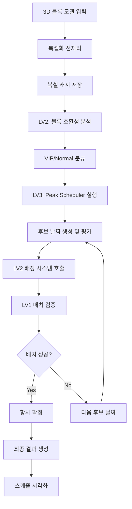

# Blockbuster: 자항선 블록 배치 최적화 시스템

## 📋 프로젝트 개요

본 프로젝트는 조선소에서 자항선(Self-Propelled Floating Dock)을 이용한 대형 블록 운송 시 발생하는 **3차원 블록 배치 최적화 문제**를 해결하는 통합 시스템입니다. 복잡한 형상의 선박 블록을 효율적으로 배치하고 스케줄링하여 운송비용을 최소화하고 납기를 준수하는 것을 목표로 합니다.

### 1. 프로젝트 배경

#### 1.1. 국내외 시장 현황 및 문제점

**조선업계 현황**

- 국내 조선업은 세계 1위 수주량을 기록하며 글로벌 시장을 선도
- 대형 선박 건조 시 블록 단위 제작 후 최종 조립하는 블록 공법이 표준
- 블록 운송을 위한 자항선 활용이 증가하고 있으나 배치 계획은 여전히 수작업 의존

**기존 문제점**

- **수작업 기반 배치 계획**: 숙련 작업자의 경험에 의존하여 일관성 부족
- **비효율적 공간 활용**: 낮은 공간 활용률로 인한 운송 효율 저하
- **복잡한 제약 조건**: 블록 간 이격거리, 크레인 접근성, 안전 여백 등 다양한 제약
- **스케줄링 복잡성**: 다수의 자항선과 수백 개의 블록에 대한 최적 스케줄 수립 어려움
- **높은 운송비용**: 비효율적 배치로 인한 추가 항차 발생 및 비용 증가

#### 1.2. 필요성과 기대효과

**필요성**

- 조선업 경쟁력 강화를 위한 디지털 전환 필수
- 블록 운송비용 절감을 통한 수익성 개선 요구
- 납기 준수율 향상을 통한 고객 만족도 제고
- 작업자 의존도 감소 및 표준화된 프로세스 구축

**기대효과**

- **항차 수 감소를 통한 운송비용 절감**: 최적화된 배치를 통한 항차 수 감소
- **모든 블록 납기 준수**: 정확한 스케줄링을 통한 납기 관리
- **작업 시간 80% 단축**: 자동화된 배치 계획 수립
- **표준화된 프로세스**: 일관성 있는 배치 품질 보장

### 2. 개발 목표

#### 2.1. 목표 및 세부 내용

**전체 목표**
자항선 블록 배치 및 스케줄링의 완전 자동화를 통한 조선소 운영 효율성 극대화

**세부 목표**

1. **3D 블록 모델 처리**: FBX/OBJ 형식의 3D 모델을 2.5D 복셀로 변환
2. **최적화 알고리즘 개발**: Greedy 기반 배치 알고리즘으로 85% 이상 배치율 달성
3. **제약 조건 처리**: 안전여백, 크레인 접근성, 블록 간 이격거리 등 실제 제약 반영
4. **스케줄링 시스템**: 블록 데드라인과 자항선 사이클을 고려한 최적 스케줄 생성
5. **시각화 시스템**: 배치 결과 및 스케줄을 직관적으로 확인할 수 있는 인터페이스 제공

**주요 기능**

- **LV0**: 3D 블록 모델을 2.5D 복셀로 변환 (Voxelization)
- **LV1**: 2단계 Greedy 배치 알고리즘 (Block Placement)
- **LV2**: 블록 호환성 분석 및 항차별 배정 시스템
- **LV3**: 통합 스케줄링 및 Peak Scheduler 최적화

#### 2.2. 기존 서비스 대비 차별성

**기존 솔루션과의 비교**

| 구분           | 기존 방식      | 본 시스템                |
| -------------- | -------------- | ------------------------ |
| 배치 계획      | 수작업/2D 기반 | 자동화/2.5D 복셀 기반    |
| 계획 수립 시간 | 수 일          | 약 6분 30초              |
| 제약 조건 처리 | 단순화된 조건  | 실제 현장 제약 자동 반영 |
| 시각화         | 2D 탑뷰        | 3D 블록 시각화           |

**핵심 차별점**

1. **복셀 기반 정밀 배치**: 0.5m 해상도의 복셀을 통한 정확한 형상 표현
2. **2단계 최적화**: Primary Phase + Retry Phase로 배치율 극대화
3. **통합 시스템**: 배치-배정-스케줄링의 End-to-End 자동화
4. **실시간 검증**: LV1 배치 엔진과 연동한 실제 배치 가능성 검증
5. **확장 가능 아키텍처**: 새로운 자항선 및 제약 조건 쉽게 추가 가능

#### 2.3. 사회적 가치 도입 계획

**환경적 가치**

- **탄소 배출 저감**: 최적화된 배치를 통한 항차 수 감소로 연료 소비 20% 절약
- **해양 환경 보호**: 효율적 운항으로 해양 오염물질 배출 최소화
- **자원 활용 최적화**: 자항선 가동률 향상을 통한 자원 효율성 증대

**경제적 가치**

- **중소 조선소 지원**: 고가의 전문 인력 없이도 최적화된 배치 계획 수립 가능
- **일자리 창출**: 디지털 전환을 통한 고부가가치 업무로 일자리 질 향상
- **수출 경쟁력 강화**: 원가 절감을 통한 국내 조선업 글로벌 경쟁력 제고

**기술적 가치**

- **오픈소스 기여**: 핵심 알고리즘의 학술적 공개를 통한 연구 발전 기여
- **교육 활용**: 대학 및 연구기관의 최적화 알고리즘 교육 자료로 활용
- **표준화 기여**: 조선업계 블록 배치 표준 프로세스 정립에 기여

### 3. 시스템 설계

#### 3.1. 시스템 구성도

**전체 시스템 아키텍처**

```
┌─────────────────────────────────────────────────────────────────┐
│                    Blockbuster 통합 시스템                        │
├─────────────────────────────────────────────────────────────────┤
│  LV3: 통합 스케줄링 시스템                                          │
│  ┌─────────────────┐  ┌─────────────────┐  ┌─────────────────┐   │
│  │ Peak Scheduler  │  │ Schedule Visual │  │ Placement Images│   │
│  │ (lv3_peak_...)  │  │ (schedule_...)  │  │ (generate_...)  │   │
│  └─────────────────┘  └─────────────────┘  └─────────────────┘   │
├─────────────────────────────────────────────────────────────────┤
│  LV2: 블록 배정 시스템                                             │
│  ┌─────────────────┐  ┌─────────────────┐  ┌─────────────────┐   │
│  │ Block Labeling  │  │ Voyage Assigner │  │ Compatibility   │   │
│  │ (block_label..) │  │ (lv2_assign...) │  │ Analysis        │   │
│  └─────────────────┘  └─────────────────┘  └─────────────────┘   │
├─────────────────────────────────────────────────────────────────┤
│  LV1: 블록 배치 시스템                                             │
│  ┌─────────────────┐  ┌─────────────────┐  ┌─────────────────┐   │
│  │ Voxelizer       │  │ Greedy Placer   │  │ Visualizer      │   │
│  │ (3D→2.5D 변환)   │  │ (2단계 배치)     │  │ (결과 시각화)     │   │
│  └─────────────────┘  └─────────────────┘  └─────────────────┘   │
├─────────────────────────────────────────────────────────────────┤
│  데이터 레이어                                                     │
│  ┌─────────────────┐  ┌─────────────────┐  ┌─────────────────┐   │
│  │ 3D Block Models │  │ Vessel Specs    │  │ Block Deadlines │   │
│  │ (.obj/.fbx)     │  │ (.json)         │  │ (.csv)          │   │
│  └─────────────────┘  └─────────────────┘  └─────────────────┘   │
└─────────────────────────────────────────────────────────────────┘
```

**데이터 흐름도**

```
[3D 블록 모델] → [복셀화] → [복셀 캐시] → [호환성 분석] → [블록 배정] → [스케줄링] → [최종 결과]
      ↓              ↓           ↓             ↓            ↓           ↓
   FBX/OBJ        Voxelizer   JSON Cache   Block Label   LV2 Assign  LV3 Peak
```

#### 3.2. 사용 기술

**핵심 기술 스택**

| 분야            | 기술       | 버전  | 용도                          |
| --------------- | ---------- | ----- | ----------------------------- |
| **언어**        | Python     | 3.8+  | 전체 시스템 개발              |
| **수치연산**    | NumPy      | 1.21+ | 복셀 데이터 처리 및 배치 계산 |
| **3D 처리**     | Trimesh    | 3.15+ | 3D 모델 로딩 및 복셀화        |
| **시각화**      | Matplotlib | 3.5+  | 배치 결과 및 성능 지표 시각화 |
| **데이터 처리** | Pandas     | 1.3+  | CSV 데이터 처리 및 분석       |
| **웹 시각화**   | Plotly     | 5.0+  | 대화형 간트 차트 생성         |

**알고리즘 및 최적화**

- **복셀화 알고리즘**: Trimesh 내장 복셀화 + 방향 최적화
- **배치 알고리즘**: 2단계 Greedy 알고리즘 (Primary + Retry Phase)
- **스케줄링 알고리즘**: Peak-based 날짜 선택 + LRU 캐싱

**데이터 형식**

- **입력**: FBX/OBJ (3D 모델), JSON (설정), CSV (스케줄/데드라인)
- **중간**: JSON (복셀 캐시, 배정 결과)
- **출력**: PNG (시각화), HTML (간트 차트), JSON (최종 결과)

### 4. 개발 결과

#### 4.1. 전체 시스템 흐름도

**End-to-End 워크플로우**



**시스템 간 상호작용**

1. **LV1 ↔ LV2**: 배치 가능성 검증
2. **LV2 ↔ LV3**: 배정 결과 전달 및 스케줄링 피드백
3. **LV3 → LV1**: 최종 배치 이미지 생성 요청

#### 4.2. 기능 설명 및 주요 기능 명세서

**LV1: 블록 배치 시스템**

| 기능            | 입력                     | 출력                  | 설명                                     |
| --------------- | ------------------------ | --------------------- | ---------------------------------------- |
| **복셀화**      | 3D 모델(.obj/.fbx)       | 복셀 데이터(.json)    | 3D 모델을 2.5D 복셀로 변환 (0.5m 해상도) |
| **Config 생성** | 자항선 사양, 블록 리스트 | 설정 파일(.json)      | 배치 실행을 위한 설정 자동 생성          |
| **Greedy 배치** | 설정 파일, 복셀 데이터   | 배치 결과(.json/.png) | 2단계 그리디 알고리즘으로 최적 배치      |
| **성능 평가**   | 배치 결과                | 성능 지표             | 배치율, 공간효율성, Dead Space 분석      |

**LV2: 블록 배정 시스템**

| 기능               | 입력                     | 출력               | 설명                           |
| ------------------ | ------------------------ | ------------------ | ------------------------------ |
| **호환성 분석**    | 복셀 캐시, 자항선 사양   | 호환성 결과(.json) | 블록별 적재 가능 자항선 분석   |
| **VIP 분류**       | 호환성 결과              | VIP 라벨링         | 자항선1 전용 블록을 VIP로 분류 |
| **통합 배정**      | 데드라인, 스케줄, 호환성 | 배정 결과(.json)   | 데드라인 기반 최적 블록 배정   |
| **Top-off 최적화** | 배정 결과                | 최적화된 배정      | 남은 공간에 추가 블록 배정     |

**LV3: 통합 스케줄링 시스템**

| 기능               | 입력          | 출력               | 설명                             |
| ------------------ | ------------- | ------------------ | -------------------------------- |
| **Peak Scheduler** | 블록 데드라인 | 항차 스케줄(.json) | 데드라인 기반 최적 날짜 선택     |
| **사이클 관리**    | 자항선 사양   | 가용성 정보        | 자항선별 운항 사이클 추적        |
| **Rescue Pass**    | 미배정 블록   | 추가 배정          | 배치율 극대화를 위한 구제 시스템 |
| **시각화**         | 최종 결과     | HTML/PNG           | 간트 차트 및 배치 이미지 생성    |

#### 4.3. 디렉토리 구조

```
Blockbuster_lv123/
├── LV1/                          # 블록 배치 시스템
│   ├── Preprocessing/            # 전처리 모듈
│   │   ├── Voxelizer.py         # 3D→복셀 변환기
│   │   ├── batch_voxelizer.py   # 배치 복셀화
│   │   └── convert_fbx_to_obj.py # FBX→OBJ 변환
│   ├── algorithms/              # 배치 알고리즘
│   │   ├── greedy_placer.py     # 그리디 배치 알고리즘
│   │   └── bottom_right_placer.py # 우하단 우선 배치
│   ├── models/                  # 데이터 모델
│   │   ├── voxel_block.py       # 복셀 블록 클래스
│   │   └── placement_area.py    # 배치 영역 클래스
│   ├── ship_placers/            # 배치 실행기
│   │   ├── ship_placer.py       # 메인 배치 엔진
│   │   └── integrated_placement_visualizer.py # 시각화
│   ├── config_generator.py      # 설정 생성기
│   ├── placement_api.py         # 배치 API
│   └── LV1명세서.md            # LV1 상세 문서
├── LV2/                          # 블록 배정 시스템
│   ├── block_labeling.py        # 블록 호환성 분석
│   ├── lv2_assignment.py        # 통합 배정 시스템
│   ├── cleanup_voxel_cache.py   # 캐시 정리 유틸
│   └── LV2명세서.md            # LV2 상세 문서
├── LV3/                          # 통합 스케줄링 시스템
│   ├── lv3_peak_scheduler.py    # Peak 스케줄러
│   ├── schedule_visualizer.py   # 스케줄 시각화
│   ├── generate_placement_images.py # 배치 이미지 생성
│   └── LV3명세서.md            # LV3 상세 문서
├── data/                         # 입력 데이터
│   ├── block_deadline_7.csv     # 블록 데드라인 (369개 블록)
│   └── vessel_schedule_7.csv    # 자항선 스케줄
├── voxel_cache/                  # 복셀 캐시 (446개 파일)
├── placement_results/            # 배치 결과 이미지 (68개 PNG)
├── utils/                        # 공통 유틸리티
│   └── visualizer.py            # 시각화 도구
├── vessel_specs.json            # 자항선 사양 (5척)
└── README.md                    # 본 문서
```

#### 4.4. 산업체 멘토링 의견 및 반영 사항

**멘토링 주요 피드백**

채워넣을 예정 !!!!!!!!!!!!!!!!!!!!!!!!

### 5. 설치 및 실행 방법

#### 5.1. 설치절차 및 실행 방법

**시스템 요구사항**

- **운영체제**: Windows 10/11, macOS 10.15+, Ubuntu 18.04+
- **Python**: 3.8 이상
- **메모리**: 8GB RAM 이상 권장
- **저장공간**: 2GB 이상 (복셀 캐시 포함)

**필수 라이브러리 설치**

```bash
# 가상환경 생성 (권장)
python -m venv blockbuster_env
source blockbuster_env/bin/activate  # Linux/Mac
# blockbuster_env\Scripts\activate   # Windows

# 필수 패키지 설치
pip install numpy>=1.21.0
pip install matplotlib>=3.5.0
pip install trimesh>=3.15.0
pip install pandas>=1.3.0
pip install plotly>=5.0.0
pip install pathlib
```

**프로젝트 설정**

```bash
# 프로젝트 클론 또는 다운로드
git clone <repository_url>
cd Blockbuster_lv123

# 복셀 캐시 준비 (voxel_cache.zip이 있는 경우)
# 자동으로 해제되므로 별도 작업 불필요
```

**단계별 실행 방법**

**1단계: LV1 복셀화 및 배치 테스트**

```bash
# 기본 실행 (Greedy 알고리즘)
python ship_placer.py config_20250911_143022.json

# 시각화 포함
python ship_placer.py config_20250911_143022.json -v

# Dead Space 분석 포함
python ship_placer.py config_20250911_143022.json -v --deadspace

# 타임아웃 설정
python ship_placer.py config_20250911_143022.json 30 -v
```

**2단계: LV2 블록 배정 시스템**

```bash
cd LV2

# 블록 호환성 분석
python block_labeling.py

# 통합 배정 실행
python lv2_assignment.py
```

**3단계: LV3 통합 스케줄링**

```bash
cd LV3

# Peak Scheduler 실행
python lv3_peak_scheduler.py

# 배치 이미지 생성
python generate_placement_images.py

# 스케줄 시각화
python schedule_visualizer.py
```

**통합 실행 (전체 파이프라인) - LV3와 같음**

```bash
cd LV3

# Peak Scheduler 실행
python lv3_peak_scheduler.py

# 배치 이미지 생성
python generate_placement_images.py

# 스케줄 시각화
python schedule_visualizer.py
```

#### 5.2. 오류 발생 시 해결 방법

**자주 발생하는 오류 및 해결책**

1. **ModuleNotFoundError: No module named 'trimesh'**

   ```bash
   # 해결방법
   pip install trimesh
   # 또는 conda 사용시
   conda install -c conda-forge trimesh
   ```

2. **FileNotFoundError: vessel_specs.json 파일이 없습니다**

   ```bash
   # 해결방법: 프로젝트 루트 디렉토리에서 실행 확인
   pwd  # 현재 위치 확인
   ls vessel_specs.json  # 파일 존재 확인
   ```

3. **복셀 캐시 관련 오류**

   ```bash
   [ERROR] voxel_cache 디렉토리를 찾을 수 없습니다

   # 해결방법 1: 복셀화 재실행
   cd LV1
   python Preprocessing/Voxelizer.py

   # 해결방법 2: 캐시 정리 후 재생성
   cd LV2
   python cleanup_voxel_cache.py
   ```

4. **메모리 부족 오류**

   ```bash
   # 해결방법: 배치 크기 조정
   # config_generator.py에서 자항선 크기를 작게 설정
   # 또는 블록 수를 줄여서 테스트
   ```

5. **시각화 오류 (matplotlib)**

   ```bash
   # GUI 백엔드 오류 시
   export MPLBACKEND=Agg  # Linux/Mac
   set MPLBACKEND=Agg     # Windows

   # 또는 코드에서
   import matplotlib
   matplotlib.use('Agg')
   ```

**성능 최적화 팁**

- **복셀 해상도 조정**: 테스트 시 1.0m로 설정하여 속도 향상
- **블록 수 제한**: 초기 테스트 시 10-20개 블록으로 제한
- **캐시 활용**: 복셀 캐시 재사용으로 전처리 시간 단축

### 6. 소개 자료 및 시연 영상

#### 6.1. 프로젝트 소개 자료

**주요 문서**

- **최종보고서**: `docs/01.보고서/03.최종보고서.pdf` (22MB)

  - 프로젝트 전체 개요 및 기술적 세부사항
  - 알고리즘 성능 분석 및 실험 결과
  - 산업체 멘토링 피드백 및 개선사항

- **프로젝트 포스터**: `docs/02.포스터/포스터파일.pdf` (3MB)

  - 핵심 기능 및 성과 요약
  - 시각적 결과물 및 성능 지표
  - 시스템 아키텍처 다이어그램

- **발표자료**: `docs/03.발표자료/발표자료.pdf` (2MB)
  - 프로젝트 배경 및 목표
  - 기술적 접근 방법 및 구현 결과
  - 향후 발전 방향 및 활용 계획

**기술 명세서**

- **LV1 상세 문서**: `LV1/LV1명세서.md` - 블록 배치 시스템 완전 가이드
- **LV2 상세 문서**: `LV2/LV2명세서.md` - 블록 배정 시스템 매뉴얼
- **LV3 상세 문서**: `LV3/LV3명세서.md` - 통합 스케줄링 시스템 가이드

#### 6.2. 시연 영상

https://drive.google.com/file/d/1a-pBQewV7Spl5VdhTA067g3thz9Sr1XU/view?usp=sharing

### 7. 팀 구성

#### 7.1. 팀원별 소개 및 역할 분담

**프로젝트 팀: Blockbuster 개발팀**

#### **서민성**

- **핵심 역할**: 데이터 전처리, 핵심 배치 알고리즘(LV1) 및 3D 시각화 개발
- **세부 기여 내용**:
  - 2.5D 벽체 전처리 파이프라인 구축
  - Column-Based Placement (CBP) 핵심 배치 알고리즘 구현
  - Python-Unity 연동 3D 시각화 시스템 개발

#### **유주연**

- **핵심 역할**: Level 2: 낱기울 기반 블록 선별 및 배치 최적화 시스템 개발
- **세부 기여 내용**:
  - 블록 배치 유연성에 따른 VIP 기반 블록 자동 라벨링 시스템 개발
  - 낱기울 및 우선순위 기반으로 후보 블록을 선별하는 배정 로직 구현
  - LV1 API 연동을 통한 물리적 배치 검증 및 통합 배치 시스템 완성

#### **김도완**

- **핵심 역할**: Level 3: 자동 항차 생성 알고리즘 개발
- **세부 기여 내용**:
  - 전체 물류의 낱기를 분포분석하여 운송 수요 "피크(Peak)"를 탐색하는 알고리즘 개발
  - 최적 항차 조합을 판단하는 가치 기반 스코어링 함수 설계
  - 라운드 기반 점진적 최적화 아키텍처를 통해 최종 스케줄을 생성하는 시스템 구현

**기술적 기여도**

- **알고리즘 설계**: 2단계 Greedy 배치, Peak Scheduler, VIP 분류 시스템
- **데이터 구조**: 복셀 기반 블록 표현, 자항선 사이클 모델링
- **시스템 통합**: LV1-LV2-LV3 연동 아키텍처 설계
- **성능 최적화**: LRU 캐싱, 결정론적 실행, 메모리 최적화

#### 7.2. 팀원 별 참여 후기

**유주연**

이번 프로젝트를 통해 실제 협업 개발 환경에서 다른 팀원이 만든 API를 활용하여 연계 시스템을 구축하는 경험을 처음으로 해볼 수 있었다.

협업 과정에서 GitHub을 활용하면서 브랜치 관리, 코드 리뷰, 충돌 해결 등 실무에서 필수적인 버전 관리 스킬을 자연스럽게 익힐 수 있었던 것도 큰 도움이 되었다. 또한 지속적인 문서화 과정을 통해 개발 내용을 정리하고 팀원들과 공유하는 습관을 기를 수 있었으며, 이를 통해 프로젝트 전체 프로세스를 처음부터 끝까지 경험할 수 있었다.

**서민성**

이번 프로젝트를 통해 실제 산업 환경에서의 문제 해결 프로세스를 경험해볼 수 있었다.
배치 알고리즘 개발 과정에서 알고리즘 최적화의 중요성에 대해 학습했고, 완전 탐색으로 해결하지 못하는 상황에 대한 최적에 가까운 해법을 고안 해볼 수 있었다.
또한 실험 설계를 통해 알고리즘의 성능을 기존 방식과 비교하면서 실험적 검증의 중요성을 체감했고, 데이터 기반의 문제 해결 능력을 키울 수 있었다.

**김도완**
작성 예정 !!!!

### 8. 참고 문헌 및 출처

**데이터셋 출처**

- **3D 블록 모델**: 조선소 실제 블록 데이터
- **자항선 사양**: 국내 주요 조선소 자항선 운영 데이터
- **블록 데드라인**: 실제 선박 건조 스케줄 기반 생성 데이터

**개발 도구 및 환경**

- **개발 언어**: Python 3.8+
- **IDE**: Visual Studio Code, PyCharm
- **버전 관리**: Git, GitHub
- **문서화**: Markdown, Sphinx
- **시각화**: Matplotlib, Plotly, Mermaid
